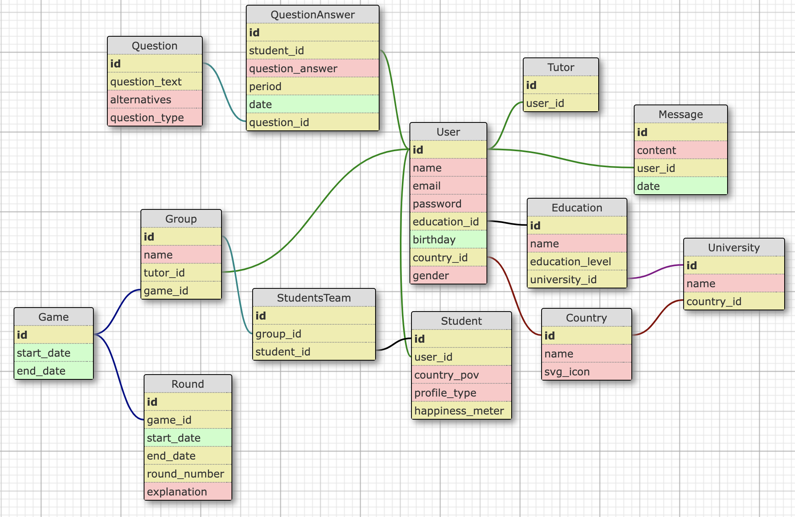

## Modelo Relacional do Banco de Dados

&nbsp;&nbsp;&nbsp;&nbsp;O modelo relacional de banco de dados foi feito no site `kitt.lewagon.com/db` organiza as informações de forma que se relacionem de acordo com o propósito do projeto. O diagrama apresenta as tabelas como entidades que possuem uma lista de atributos, estabelecendo relações entre elas por meio de linhas. Abaixo estão detalhadas as tabelas e seus respectivos atributos, incluindo as chaves primárias e estrangeiras:

Figura X - Estrutura do banco de dados

Fonte: Material produzido pelos autores (2024)

### Relações 1:N

- **User -> Education**: Um `Education` pode ser associado a vários `User`, mas um `User` possui apenas uma `Education`.
- **User -> Country** (indiretamente através de `Education` e `University`): Um `Country` pode estar associado a vários `User` através de `University` e `Education`.
- **Education -> University**: Uma `University` pode ser associada a várias `Education`, mas uma `Education` está associada a apenas uma `University`.
- **University -> Country**: Um `Country` pode estar associado a várias `University`, mas uma `University` está associada a apenas um `Country`.
- **Group -> Game**: Um `Game` pode estar associado a vários `Group`, mas um `Group` está associado a apenas um `Game`.
- **Round -> Game**: Um `Game` pode ter várias `Round`, mas uma `Round` está associada a apenas um `Game`.
- **QuestionAnswer -> User**: Um `User` pode ter várias `QuestionAnswer`, mas uma `QuestionAnswer` está associada a apenas um `User`.
- **QuestionAnswer -> Question**: Uma `Question` pode estar associada a várias `QuestionAnswer`, mas uma `QuestionAnswer` está associada a apenas uma `Question`.
- **Student -> User**: Um `User` pode estar associado a várias `Student`, mas uma `Student` está associada a apenas um `User`.
- **Tutor -> User**: Um `User` pode estar associado a várias `Tutor`, mas um `Tutor` está associado a apenas um `User`.
- **Message -> User**: Um `User` pode ter várias `Message`, mas uma `Message` está associada a apenas um `User`.

### Relações N:N

- **User -> Group**: Um `User` pode estar em vários `Group` como tutor, e um `Group` pode ter vários tutores (indiretamente relacionados por `Tutor` ou outras estruturas não explícitas no esquema).
- **Student -> Group**: Um `Student` pode estar em vários `Group`, e um `Group` pode ter vários `Student`. Esta relação é implementada por meio da tabela `StudentsTeam`.

### Tabela: `User`

- **id** (INTEGER, CHAVE PRIMÁRIA)
- **name** (TEXT)
- **email** (TEXT)
- **password** (TEXT)
- **education_id** (INTEGER, CHAVE ESTRANGEIRA referenciando `Education(id)`)
- **birthday** (DATE)
- **country_id** (INTEGER, CHAVE ESTRANGEIRA referenciando `Country(id)`)
- **gender** (TEXT)

### Tabela: `Education`

- **id** (INTEGER, CHAVE PRIMÁRIA)
- **name** (VARCHAR)
- **education_level** (INTEGER)
- **university_id** (INTEGER, CHAVE ESTRANGEIRA referenciando `University(id)`)

### Tabela: `University`

- **id** (INTEGER, CHAVE PRIMÁRIA)
- **name** (VARCHAR)
- **country_id** (INTEGER, CHAVE ESTRANGEIRA referenciando `Country(id)`)

### Tabela: `Country`

- **id** (INTEGER, CHAVE PRIMÁRIA)
- **name** (VARCHAR)
- **svg_icon** (TEXT)

### Tabela: `Group`

- **id** (INTEGER, CHAVE PRIMÁRIA)
- **name** (TEXT)
- **tutor_id** (INTEGER, CHAVE ESTRANGEIRA referenciando `User(id)`)
- **game_id** (INTEGER, CHAVE ESTRANGEIRA referenciando `Game(id)`)

### Tabela: `Game`

- **id** (INTEGER, CHAVE PRIMÁRIA)
- **start_date** (DATE)
- **end_date** (DATE)

### Tabela: `Round`

- **id** (INTEGER, CHAVE PRIMÁRIA)
- **game_id** (INTEGER, CHAVE ESTRANGEIRA referenciando `Game(id)`)
- **start_date** (DATE)
- **end_date** (INTEGER)
- **round_number** (INTEGER)
- **explanation** (TEXT)

### Tabela: `Question`

- **id** (INTEGER, CHAVE PRIMÁRIA)
- **question_text** (INTEGER)
- **alternatives** (VARCHAR)
- **question_type** (VARCHAR)

### Tabela: `QuestionAnswer`

- **id** (INTEGER, CHAVE PRIMÁRIA)
- **student_id** (INTEGER, CHAVE ESTRANGEIRA referenciando `User(id)`)
- **question_answer** (CHAR)
- **period** (INTEGER)
- **date** (DATE)
- **question_id** (INTEGER, CHAVE ESTRANGEIRA referenciando `Question(id)`)

### Tabela: `Student`

- **id** (INTEGER, CHAVE PRIMÁRIA)
- **user_id** (INTEGER, CHAVE ESTRANGEIRA referenciando `User(id)`)
- **country_pov** (VARCHAR)
- **profile_type** (TEXT)

### Tabela: `Tutor`

- **id** (INTEGER, CHAVE PRIMÁRIA)
- **user_id** (INTEGER, CHAVE ESTRANGEIRA referenciando `User(id)`)

### Tabela: `StudentsTeam`

- **id** (INTEGER, CHAVE PRIMÁRIA)
- **group_id** (INTEGER, CHAVE ESTRANGEIRA referenciando `Group(id)`)
- **student_id** (INTEGER, CHAVE ESTRANGEIRA referenciando `Student(id)`)

### Tabela: `Message`

- **id** (INTEGER, CHAVE PRIMÁRIA)
- **content** (TEXT)
- **user_id** (INTEGER, CHAVE ESTRANGEIRA referenciando `User(id)`)
- **date** (DATE)

## Relacionamentos

- A tabela `User` é central no esquema, conectando-se com `Group`, `QuestionAnswer`, `Student`, `Tutor` e `Message` através de chaves estrangeiras.
- `Education` se conecta a `User` e indiretamente a `University`.
- `University` se conecta a `Education` e também está ligada a `Country`.
- `Game` se conecta a `Group`, `Round`.
- `Question` e `QuestionAnswer` ligam perguntas às respostas dos usuários.
- `StudentsTeam` conecta `Group` e `Student`, estabelecendo uma relação entre os estudantes e seus respectivos grupos.
